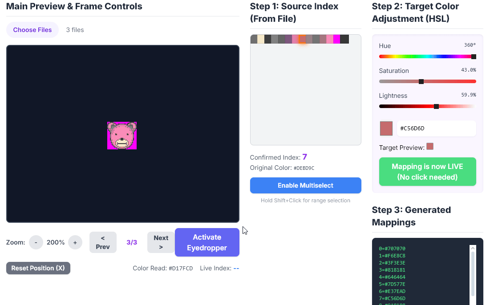

# 🎨 Image to BMP v-24 Palette Editor

[](https://github.com/yourusername/index-changing-tool)
[](https://developer.mozilla.org/en-US/docs/Web/Guide/HTML/HTML5)
[](https://developer.mozilla.org/en-US/docs/Web/JavaScript)
[](https://tailwindcss.com/)

A powerful, browser-based palette editor for converting images to BMP v-24 format with advanced color remapping capabilities. Perfect for pixel art, game development, and animation workflows! ✨



## 🌟 Features

### 🎯 **Core Functionality**
- **Multi-frame Animation Support** - Load multiple image files to create animation sequences
- **Advanced Palette Extraction** - Automatically extracts up to 256 colors from your images
- **Real-time Color Remapping** - Live preview of all color changes across all frames
- **Precise Color Control** - HSL sliders with real-time hex input for perfect color matching
- **Eyedropper Tool** - Click directly on your image to select colors for editing
- **Multiselect Mode** - Edit multiple palette colors simultaneously with relative HSL adjustments

### 🖼️ **Image Handling**
- **Multiple Format Support** - Import PNG, JPG, GIF, and more
- **Advanced Zoom & Pan** - Drag-to-pan with mouse (left-click or middle-click) anywhere on canvas
- **Scroll Wheel Zoom** - Zoom in/out smoothly with your mouse wheel (100% to 1600%)
- **Frame Navigation** - Easy switching between animation frames with buttons or arrow keys
- **Tiled Preview** - See multiple frames side-by-side for animation review
- **Position Reset** - Instantly recenter image with button or 'X' key

### 🎨 **Color Management**
- **256-Color Palette Grid** - Visual representation of all extracted colors
- **Single & Multi-Select** - Edit one color or multiple colors at once
- **Shift+Click Range Selection** - Select ranges of colors quickly
- **Relative HSL Adjustments** - Multiselect preserves color relationships while adjusting
- **Smart Color Protection** - Prevents colors from becoming identical (especially black/white)
- **Live Color Mapping** - Changes apply instantly across all frames
- **Color Distance Matching** - Intelligent color matching using RGB distance algorithms

### 📤 **Export Options**
- **PNG Export** - Standard PNG format with transparency support
- **BMP v-24 Export** - Pure JavaScript BMP generation (24-bit uncompressed)
- **Batch Export** - Export all frames at once with automatic naming
- **Mapping Export** - Copy color mappings to clipboard for external use

### 🎮 **User Experience**
- **Responsive Design** - Works perfectly on desktop and mobile devices
- **Modern UI** - Beautiful interface built with Tailwind CSS
- **Real-time Feedback** - Instant visual feedback for all operations
- **Keyboard Shortcuts** - Full keyboard control for efficient workflow

## 🚀 Getting Started

### Quick Start
1. **Open** `PalletteEditor8.html` in any modern web browser
2. **Upload** one or more image files using the file input
3. **Select** colors from the extracted palette grid
4. **Adjust** colors using HSL sliders or hex input
5. **Export** your remapped frames as PNG or BMP

### Workflow Example
```
📁 Load Images → 🎨 Extract Palette → 🎯 Select Colors → 
🌈 Adjust Colors → 👁️ Preview Changes → 💾 Export Results
```

## 🛠️ Technical Details

### Browser Compatibility
- **Chrome/Edge**: Full support ✅
- **Firefox**: Full support ✅  
- **Safari**: Full support ✅
- **Mobile Browsers**: Responsive design ✅

### File Format Support
- **Input**: PNG, JPG, JPEG, GIF, WebP, BMP
- **Output**: PNG (with transparency), BMP v-24 (24-bit uncompressed)

### Performance
- **Client-side Processing**: No server required - everything runs in your browser
- **Memory Efficient**: Optimized canvas handling for large images
- **Batch Processing**: Handle multiple frames simultaneously

## 🎨 Advanced Features

### Color Space Conversion
The editor uses advanced color space mathematics:
- **RGB ↔ HSL conversion** for intuitive color manipulation
- **Color distance algorithms** for accurate palette matching
- **Real-time color preview** with live updates

### Multiselect Color Editing
- **Toggle multiselect mode** to edit multiple colors at once
- **Click to select/deselect** individual palette colors
- **Shift+Click range selection** for selecting sequential colors
- **Relative HSL adjustments** - each color maintains its unique characteristics
- **Smart protection system** - prevents all selected colors from becoming identical
- **Visual feedback** - shows count of selected colors and protected colors

### Animation Tools
- **Frame-by-frame navigation** with keyboard shortcuts (arrow keys)
- **Multi-frame tiled preview** showing animation sequences
- **Global color mapping** - changes apply to all frames consistently
- **Customizable frame display count** for animation preview

### Pan & Zoom Controls
- **Drag-to-pan** - Click and drag with left mouse button or middle mouse button
- **Scroll wheel zoom** - Zoom in/out smoothly (8 zoom levels from 100% to 1600%)
- **Position reset** - Press 'X' key or click button to recenter image
- **Smart centering** - Image centers on load, stays put while panning

### Export Capabilities
- **Pure JavaScript BMP encoder** - no external dependencies
- **Automatic file naming** with zero-padded frame numbers
- **Batch download management** with staggered timing
- **Color mapping export** for use in external tools

## ⌨️ Keyboard Shortcuts

| Key | Action |
|-----|--------|
| **←** / **→** | Previous / Next frame |
| **↑** / **↓** | Previous / Next frame |
| **+** / **=** | Zoom in |
| **-** / **_** | Zoom out |
| **X** | Reset image position to center |

*Note: Keyboard shortcuts are disabled when typing in text fields*

## 📋 Usage Tips

### Best Practices
- 🎯 **Use the eyedropper** for precise color selection from your images (disabled in multiselect mode)
- 🌈 **Adjust HSL values gradually** for smooth color transitions
- 📱 **Load frames in sequence** for proper animation preview
- 💾 **Export early and often** to avoid losing work
- 🎨 **Use multiselect** to adjust similar colors while maintaining their relationships

### Pro Tips
- **Drag to pan** with left-click or middle-click anywhere on the canvas
- **Scroll wheel** to zoom in and out smoothly
- **Shift+Click** in multiselect mode to select ranges of colors
- **Arrow keys** for quick frame navigation
- **Zoom in** for pixel-perfect color selection
- **Use the tiled preview** to check animation flow
- **Copy color mappings** to reuse in other projects
- **Test different HSL combinations** for unique effects

## 🏆 Credits

**Created with love by Admin Spooki/Snoobert of CoraTO** 💜

*Making Mewsie very proud every day!* 🐱✨

<!-- altho he is a stinky dinky snoobert ;) -->

---

## 📝 License

This project is open source and available under the [MIT License](LICENSE).

## 🤝 Contributing

Contributions, issues, and feature requests are welcome! Feel free to check the [issues page](../../issues).

## 🌟 Show Your Support

Give a ⭐️ if this project helped you!

---

<div align="center">
  <p><strong>Built with passion for the pixel art and game development community</strong></p>
  <p>🎮 Happy Creating! 🎨</p>
</div>
